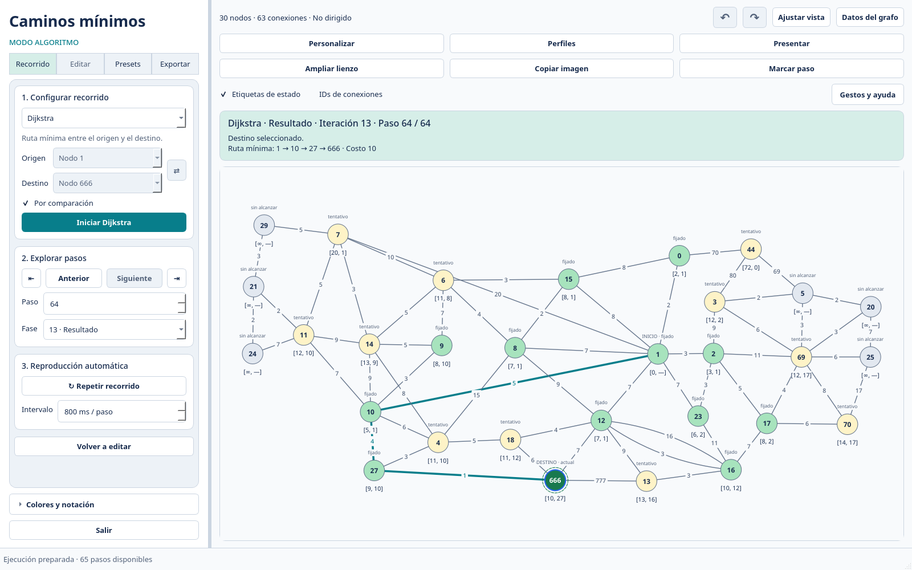

# Graph Visualizer

Aplicación de escritorio en español para crear y editar grafos y explorar paso a paso **Dijkstra, A*, Bellman-Ford y Floyd-Warshall**. Desarrollada con Python, PySide6 y NetworkX.



## Empezar

Requiere **Python 3.12+**, **uv** y un entorno gráfico. Desde la raíz del repositorio:

```bash
uv sync
uv run graph-visualizer
```

En **Editar** crea o modifica el grafo; en **Recorrido** elige el algoritmo, origen y destino y pulsa **Iniciar**. Usa **Presets** para guardar ejemplos y **Exportar** para generar PNG, PDF vectorial o SVG, con vista previa navegable.

**Personalizar** ofrece seis esquemas de color, acento propio, tamaño de texto y cuatro distribuciones de paneles. **Perfiles** guarda y comparte esa configuración; **Presentar / F11** abre el visor con teclado y marcas. Cada paso didáctico se exporta como una diapositiva horizontal **16:9 completa**, con grafo, tablas, explicación, ruta y leyenda. La composición adapta columnas y escala al contenido, también permite elegir proporción y añadir un foco; puedes elegir HD, QHD o 4K. La vista previa diagnostica el tamaño real de letra. Cada carpeta incluye el grafo y un manifiesto de los pasos originales.

## Documentación

| Tema | Guía |
| --- | --- |
| Instalación | [Ejecución, directorios y configuración](docs/instalacion.md) |
| Edición | [Nodos, conexiones, gestos e historial](docs/edicion.md) |
| Recorridos | [Navegación, reproducción y consulta de rutas](docs/recorrido.md) |
| Algoritmos | [Dijkstra](docs/algoritmos/dijkstra.md) · [A*](docs/algoritmos/astar.md) · [Bellman-Ford](docs/algoritmos/bellman-ford.md) · [Floyd-Warshall](docs/algoritmos/floyd-warshall.md) |
| Presets | [Biblioteca y formato JSON](docs/presets.md) |
| Datos | [Persistencia y compatibilidad](docs/datos.md) |
| Exportaciones | [Estilos, cantidad de imágenes y límites](docs/exportaciones.md) |
| Personalización | [Temas, distribuciones y preferencias](docs/personalizacion.md) |
| Auditoría | [Hallazgos, correcciones y estado de las siete tareas](docs/auditoria.md) |
| Arquitectura | [Organización del código y rendimiento](docs/arquitectura.md) |
| Desarrollo | [Pruebas, estilo y construcción del paquete](docs/desarrollo.md) |
| Versiones | [Cambios de 0.3.0](CHANGELOG.md) |
