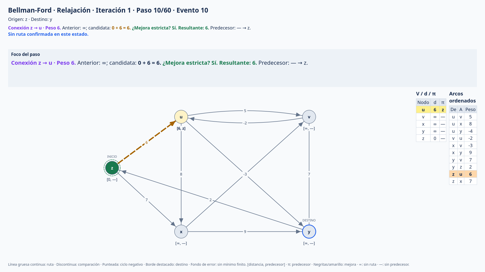
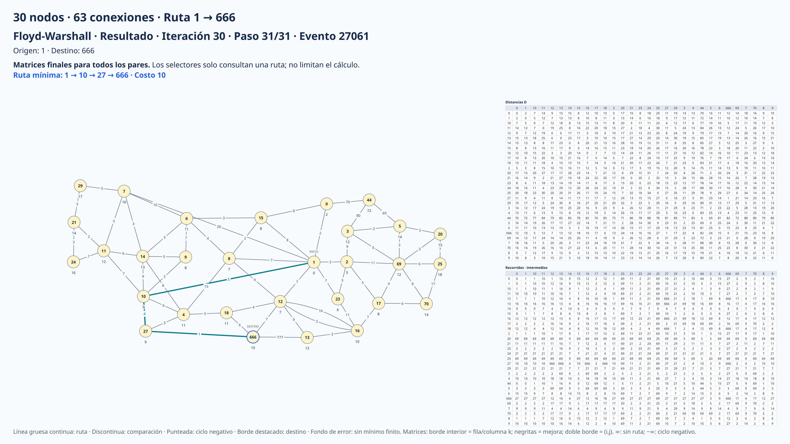
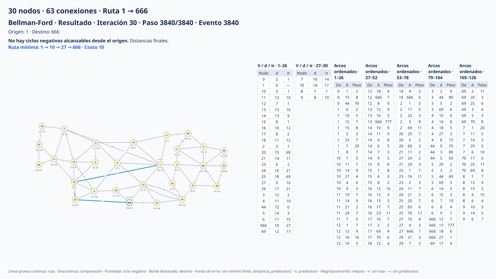
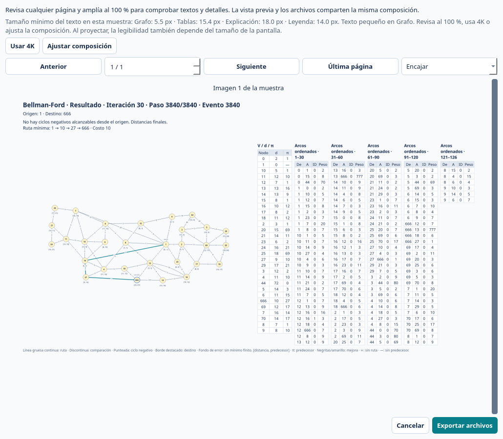

# Exportaciones PNG, PDF y SVG

[← Inicio](../README.md) · [Recorridos](recorrido.md) · [Personalización](personalizacion.md)

En **Exportar** elige PNG, PDF vectorial o SVG vectorial. Los tres formatos comparten la composición de la vista previa y son independientes del tamaño de la ventana. PDF conserva texto seleccionable; SVG permite editar los elementos en otras herramientas. No se generan PNG intermedios para los documentos vectoriales.

**Exportación** agrupa formato, estilo, esquema y resolución. **Seleccionar pasos** reúne dos decisiones: **Detalle** elige **Como en Recorrido**, **Resumen** o **Por comparación**; **Filtro** elige **Todos**, **Rango**, **Solo mejoras** o **Pasos marcados** dentro de ese detalle. Los campos **Desde** y **Hasta** aparecen solo en **Rango**. Estos ajustes se aplican a **Pasos separados** y **Conjuntas**; **Paso actual** y **Resultado final** conservan su evento exacto. Bellman-Ford mantiene un paso por arco y deshabilita el selector de detalle.

El panel se ajusta a su ancho incluso al abrir las opciones avanzadas: las filas se apilan cuando hace falta y el desplazamiento es vertical. Todas las casillas ofrecen una ayuda breve al dejar el puntero encima.

## Composición y legibilidad

**Cada paso ocupa una sola imagen horizontal 16:9**, preparada para un slideshow. Puedes elegir **1920 × 1080**, **2560 × 1440** o **3840 × 2160**, esquema de color independiente o **Como la interfaz**, y escala tipográfica de 0.8 a 1.5. PDF conserva una página horizontal por paso; PNG y SVG conservan un archivo por paso.

**Didáctico** incluye algoritmo, fase, iteración, número de paso y evento original, origen/destino, grafo, tablas, explicación, ruta y leyenda. **Composición y texto** permite añadir un título, ocultar explicación o leyenda y elegir **Grafo y tablas**, **Grafo destacado** o **Tablas destacadas**. Las tres distribuciones conservan el grafo y las tablas relevantes en la misma diapositiva. Dijkstra añade su tabla de distancias al elegir **Tablas destacadas**; en las otras distribuciones las distancias aparecen sobre el grafo.

La explicación distingue **conexión o intermedio**, **cálculo candidato**, **decisión y valor resultante**, y **ruta y costo** mediante negritas y colores semánticos del tema. Mantiene los operandos, el valor anterior y, cuando corresponde, el cambio de predecesor. El foco ampliado usa el mismo énfasis. Los colores se ajustan al contraste del fondo; **Impresión** usa texto monocromo y conserva las negritas. Los nombres de nodos se muestran como texto literal, aunque contengan signos de HTML.



Las listas se redistribuyen en columnas con encabezados y rangos de filas **dentro de la misma imagen**. Floyd-Warshall conserva completas sus matrices de distancias y recorridos, con todos los índices y resaltados originales. Bellman-Ford conserva todos los arcos ordenados, incluidos los dos sentidos de una conexión no dirigida. El compositor elige una distribución horizontal o vertical de los paneles y ajusta la escala para evitar solapamientos. La cámara del grafo y la composición permanecen fijas entre los pasos de una misma ejecución.

En **Composición** puedes conservar **Adaptativa** o forzar **Grafo a la izquierda** / **Grafo arriba**. **Espacio del grafo** reserva entre 20 % y 65 % del ancho en la composición lateral o del alto en la superior; solo se activa en las composiciones manuales. La escala de las tablas se ajusta al espacio restante y conserva todo su contenido. **Atenuar conexiones** reduce la opacidad de las conexiones fuera de la ruta sin ocultarlas; **Ampliar foco del paso** añade un foco con la comparación, celda mejorada o ruta del estado. El foco complementa las matrices y listas completas.

Los IDs largos reciben etiquetas abreviadas distintas entre sí. Las tablas usan las mismas etiquetas y una referencia en la misma diapositiva conserva los IDs completos. El título, la explicación, la ruta y los valores de las celdas ajustan su tipografía para conservar el texto completo sin puntos suspensivos adicionales. El manifiesto también registra la explicación original y los IDs completos.

La escala solicitada es una preferencia: al aumentar la cantidad de datos, el texto debe reducirse para mantener el paso completo en una imagen. No se garantiza un tamaño mínimo de letra para grafos arbitrariamente grandes. Para matrices densas, revisa la vista previa al **100 %** y conserva el PDF/SVG vectorial para ampliar los detalles. **4K** aporta más píxeles para inspección y zoom; no aumenta por sí solo el tamaño relativo de la letra al proyectar toda la diapositiva en la misma pantalla.

El diagnóstico de la vista previa informa el tamaño mínimo real de fuente en píxeles de salida para grafo, tablas y textos, después del ajuste. Advierte si una categoría queda por debajo de 12 px. **Usar 4K** cambia la resolución de la muestra y de la exportación; **Ajustar composición** vuelve a Exportar con las opciones avanzadas abiertas. El diagnóstico se refiere a las páginas de la muestra visible, no es una garantía de lectura a distancia ni un análisis de toda la ejecución.

**Simple** muestra solo el grafo, pesos, flechas, IDs de nodos y resaltados, sin tablas ni explicaciones. Por defecto, las diapositivas omiten los IDs internos de conexiones: las explicaciones usan extremos y pesos y Bellman-Ford muestra **De / A / Peso**. Activar **IDs de conexiones** añade los IDs al grafo y a la tabla de arcos; la explicación sigue usando extremos y pesos. Todos los arcos, incluidas las conexiones paralelas, permanecen en la tabla y el resaltado identifica la conexión exacta aunque su ID esté oculto. El grafo reproducible y los eventos del manifiesto conservan la identidad y la explicación original. Los valores pequeños usan notación científica para conservar su signo. `∞` significa sin ruta, `−∞` sin mínimo finito y `—` sin predecesor.





[Ejemplo PDF vectorial de Floyd-Warshall, con todos los datos en una página horizontal](images/floyd-30-diapositiva.pdf).

## Pasos y vista previa

- **Paso actual** exporta el evento exacto visible, incluso si se ha seleccionado resumen para el resto de la exportación.
- **Pasos separados** genera una diapositiva completa por cada estado seleccionado. PDF las reúne en un único documento.
- **Conjuntas** agrupa hasta dos o cuatro diapositivas completas en un lienzo horizontal mayor. Cada paso conserva su resolución: una conjunta de varias diapositivas HD mide **3840 × 2160**. La última puede contener menos pasos. Para presentar un paso por imagen, usa **Pasos separados**.
- **Resultado final** conserva el último estado de la ejecución completa, independientemente de los filtros de pasos.

Para pasos separados o conjuntas puedes seleccionar todos, un rango inclusivo, solo mejoras o pasos marcados. El rango corresponde al detalle elegido para exportar; las marcas identifican el evento original y sobreviven al cambio de detalle en la navegación. Los botones indican la cantidad real de archivos o páginas; cada estado tiene una sola diapositiva.

**Vista previa al exportar** está activada por defecto. Permite saltar a cualquier página, ir a la última y revisar a **50 %** o **100 %**. **Encajar** ajusta al ancho disponible, sin ampliar por encima de la resolución original: puede requerir desplazamiento vertical para consultar el título y la leyenda. Cada imagen conserva su altura íntegra en los tres modos y se centra horizontalmente. El ancho de la barra vertical se reserva para que su aparición no produzca un bucle de reajustes. Renderiza hasta dos páginas cercanas a la posición elegida, sin generar toda la ejecución ni alterar el lienzo. Cancelar o cerrar la vista previa vuelve sin crear archivos. **Copiar imagen** usa el paso visible, el tema y acento de la interfaz y las demás opciones de exportación actuales. Por ejemplo, una interfaz oscura copia una imagen oscura aunque el esquema de los archivos esté en Claro o Impresión; copiar no modifica esa selección.



## Archivos y cancelación

Cada operación publica una carpeta con fecha y hora. PDF se llama `diapositivas.pdf`; PNG y SVG usan nombres por paso, resultado o conjunta. No se generan archivos de continuación para un estado. En todos los formatos se incluyen:

| Archivo | Contenido |
| --- | --- |
| `manifest.json` | Opciones visuales, dimensiones, archivos/páginas, eventos originales, explicaciones completas y rutas consultadas |
| `grafo.json` | Preset con grafo, posiciones y ajustes de la ejecución para reproducirla |

Los archivos se preparan en una carpeta temporal y se publican al finalizar todas las escrituras. **Cancelar operación** elimina el trabajo parcial. Un fallo de escritura o de finalización del PDF/SVG se informa como error. El aviso de éxito permite abrir el destino real.

Las imágenes tienen un límite de 100 megapíxeles y las conjuntas un máximo de 12 000 px por lado. La cancelación se procesa entre páginas; una página en curso debe terminar de renderizarse. La ejecución detallada de Floyd-Warshall sigue generando muchos eventos: usa resumen, selección de pasos o resultado final cuando prepares material de grafos grandes.

## Exportar desde la terminal

```bash
uv run graph-visualizer \
  --export-preset src/graph_visualizer/examples/bellman_ford.json \
  --format pdf --kind final --theme print --resolution 3840 \
  --output-dir /tmp/material-grafo
```

Este modo no abre la ventana ni modifica los datos de trabajo. Usa el algoritmo y ajustes del preset; `--detail summary` o `--detail detailed` modifica el detalle de exportación. También admite `--kind all|combined|final`, `--format png|pdf|svg`, `--layout balanced|graph|tables`, `--font-scale` y `--simple`. `--composition auto|side|top` selecciona la composición; `--graph-fraction 0.35` reserva 35 % al grafo en una composición manual. `--dim-unrelated` activa la atenuación y `--focus` añade el foco. Por ejemplo, añade `--composition top --graph-fraction 0.35 --focus` al comando anterior. Imprime la ruta resultante y devuelve un código distinto de cero si falla.
