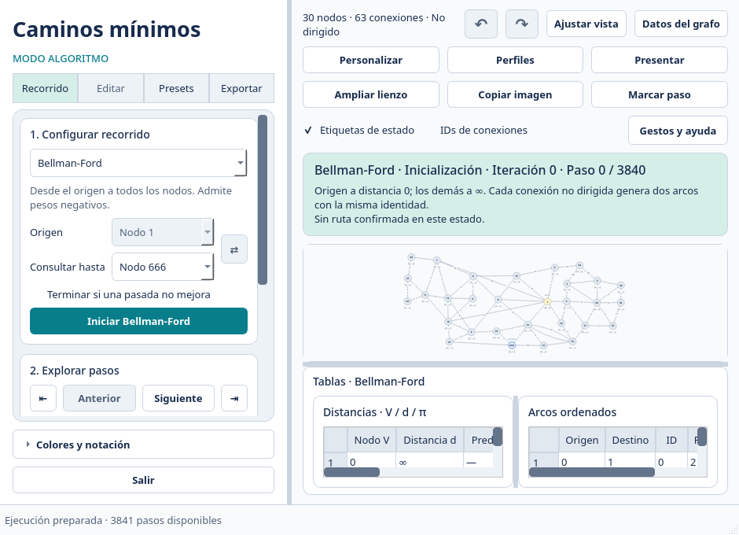

# Personalización del espacio de trabajo

[← Inicio](../README.md) · [Exportaciones](exportaciones.md)

Pulsa **Personalizar** o `Ctrl+,` para cambiar el esquema **Claro, Oscuro, Sepia, Alto contraste, Impresión o Daltónico (azul y naranja)**. Puedes elegir un acento propio, texto de interfaz de 11 a 18 px y escala del texto del grafo de 0.8 a 1.5. **Restaurar valores predeterminados** recupera los ajustes visuales iniciales. Las conexiones comparadas usan trazo discontinuo y los ciclos negativos trazo punteado, además de su color.

Las distribuciones disponibles son controles a la izquierda, controles a la derecha, tablas debajo del grafo y lienzo amplio. Los separadores permiten ajustar el espacio de controles y resultados. **Ampliar lienzo** / `Ctrl+Shift+F` oculta los controles; **Mostrar controles** recupera la distribución anterior. La interfaz mantiene colores semánticos comunes en el grafo, las tablas y la leyenda.

Con **Tablas debajo del grafo** y una ventana de menos de 820 px de alto, el modo compacto reserva al menos 150 px al grafo y 64 px a cada tabla, reduce el margen vertical del panel y oculta sus hints. Los títulos y las tablas siguen visibles y desplazables. Al ampliar, recupera hints y mínimos normales; reajusta las posiciones incompatibles del separador y conserva los tamaños manuales válidos. El mínimo de ventana puede crecer cuando otro layout o un texto mayor necesita más espacio.

El encuadre automático se adapta al tamaño de la ventana y al movimiento de los separadores. Usar la rueda conserva el zoom manual; **Ajustar vista** / `Ctrl+0` vuelve al encuadre automático. Cambiar un tema conserva las posiciones del grafo.

Las preferencias se guardan en `preferences.json`, dentro del directorio de trabajo. Incluyen apariencia, tamaño de ventana, separadores, etiquetas, IDs de conexiones y opciones de exportación. Son independientes de los presets: cargar un grafo no cambia el tema del usuario. Los valores inválidos se sustituyen por los predeterminados.

**Perfiles** / `Ctrl+Alt+P` guarda la configuración actual con un nombre y permite aplicarla, renombrarla, eliminarla o compartirla como JSON. Incluye la apariencia de la interfaz y las opciones de exportación, también composición, proporción del grafo, atenuación y foco; conserva el grafo y el evento visible al aplicar un perfil. Los perfiles se almacenan en `presentation_profiles/` y no incluyen el tamaño de ventana ni los separadores del equipo. Los archivos importados se validan antes de modificar preferencias; un archivo de preset de grafo no se acepta como perfil visual. Los perfiles antiguos reciben valores predeterminados para las opciones nuevas.

**Datos del grafo** / `Ctrl+D` ofrece tablas navegables con teclado para revisar IDs completos, coordenadas, conexiones, distancias y estados. En edición puedes escribir X/Y o seleccionar varias filas para alinear o distribuir los nodos. **Aplicar** guarda una acción deshacible. La distribución conserva los extremos de la selección; la alineación utiliza la coordenada media.

En la pestaña **Conexiones**, **Etiqueta X / Y** desplaza manualmente la etiqueta del peso respecto al centro de su arco. Puedes restablecer las etiquetas de las filas seleccionadas y aplicar el cambio. Estos ajustes se guardan con el grafo, se deshacen y se conservan en presets y exportaciones, incluidos arcos paralelos y sentidos opuestos.

`Ctrl+1`, `Ctrl+2`, `Ctrl+3` y `Ctrl+4` abren Recorrido, Editar, Presets y Exportar; una pestaña bloqueada durante el algoritmo no se activa. **Presentar** / `F11` abre el visor de las diapositivas configuradas en Exportar. Sus controles y atajos se describen en [Recorrido](recorrido.md).
